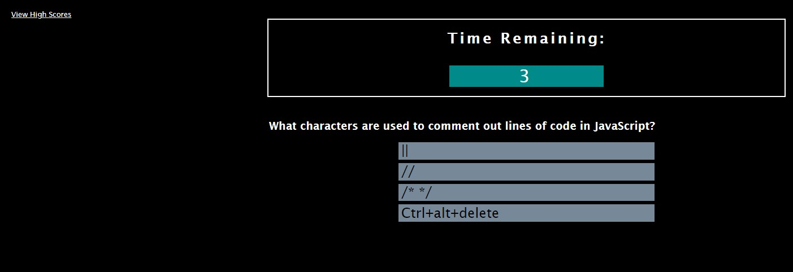

# 04-web-api-quiz

## Code Quiz Project

After learning about Web APIs and continuing to practice using JavaScript, this week's project is to create a quiz containing questions on coding. The intent of this quiz is to simulate an assessment that potential employers would present during an interview. Possible assessments may be either multiple choice questions and/ or interactive coding challenges.

This quiz must contain the following:

- start button initiates a timer
- first question appears when timer starts
- after answering a question, a new one appears
- if answer to question is wrong, time is removed from the clock
- when all questions have been answered, timer = 0 sec
- game has a 'final' status
- ability to save initials and score upon completion

Learning and Challenges:
"after answering a question, a new one appears"
I found this acceptance criteria to be the most challenging (and rewarding?) for this assingment. Getting a stronger idea of what an array of objects is and how to update the DOM element seem like very foundational JavaScript concepts that will continue to get more complex. My problem was discovering how to 'iterate' over the objects within an array (of objects). Nesting the for loops and functions within functions made for a 'messy' looking code!

[Web APIs Code Quiz Project](https://katievlasic.github.io/04-web-api-quiz)

